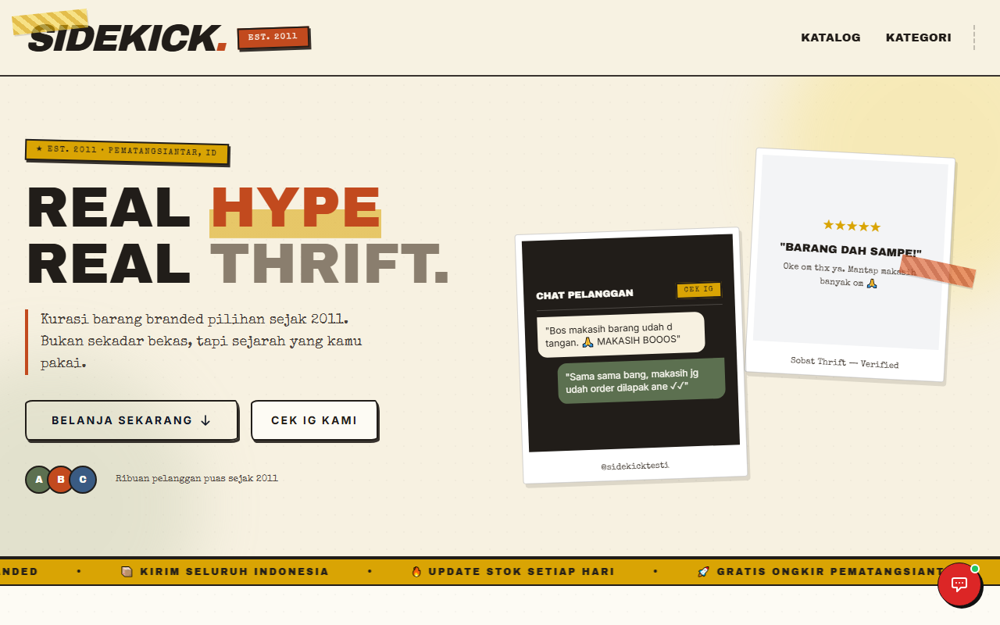
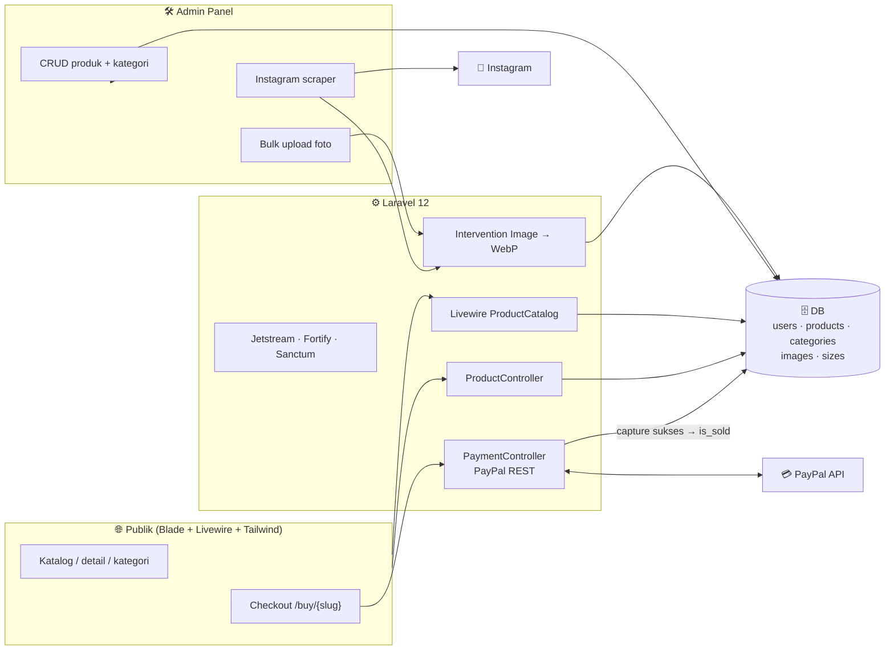

# 🛍️ Sidekick Thrift — Toko Online Thrift dengan Scraper Instagram

**Live di [sidekick.web.id](https://sidekick.web.id) — jual-beli pakaian bekas, dari post Instagram jadi katalog siap beli.**

---

## ❌ Masalahnya

- Thrift seller jualan via **Instagram** — katalog nggak rapi, pembeli harus scroll, DM manual, borong-beres
- Upload foto produk satu-satu + resize manual itu **capek**
- Pembayaran online untuk barang second sering tidak ada — CMIIW, transfer manual & titip air mata kalau pembeli hilang

## ✅ Sidekick Thrift

Toko online thrift berbasis **Laravel 12**: katalog publik yang rapi, admin panel yang produktif, dan **checkout PayPal yang otomatis menandai barang terjual**.

### ✨ Fitur

- 🛒 **Katalog Livewire** — pencarian + filter (kategori, harga, kondisi, size) + sorting + pagination, tanpa reload
- 📄 **Detail produk** — ukuran (LD/PB/LB/LP + stok), produk terkait satu kategori
- 📸 **Instagram scraper** ⭐ — tempel link post/reel IG → gambar ter-scrape jadi foto produk (workflow admin paling disayang)
- 🖼️ **Optimasi gambar otomatis** — upload banyak sekaligus → resize 800px → **WebP kualitas 80%** (hemat bandwidth puluhan persen)
- 💳 **Checkout PayPal** — direct purchase, order dibuat → capture sukses → produk **otomatis `is_sold`**
- 🔐 **Auth Jetstream** — register/login, verifikasi email, 2FA
- 🛠️ **Admin panel** — CRUD produk & kategori, toggle terjual, hapus foto per produk, dashboard statistik

---

## 🏗️ Arsitektur

- **Stack:** Laravel 12 (PHP 8.2+) · Livewire 3 · Tailwind + Vite · Jetstream 5 · Spatie Media Library 11 · Intervention Image v3 · PayPal REST API
- **Produksi:** live di [sidekick.web.id](https://sidekick.web.id) — versi produksi di-manage via server (commit `30a7b21`: order system + hardening)

---

## 🔒 Tentang Source Code

Repository ini adalah **showcase** — dokumentasi produk, bukan kode sumber.
Source code Sidekick Thrift tidak dipublikasikan dan semua hak dilindungi. Lihat [`LICENSE`](LICENSE).

> 💬 Demo, kolaborasi, atau lisensi? Hubungi [Kandar Lubis](https://github.com/kandarlubis31).

---

© 2026 Kandar Lubis — All Rights Reserved.
